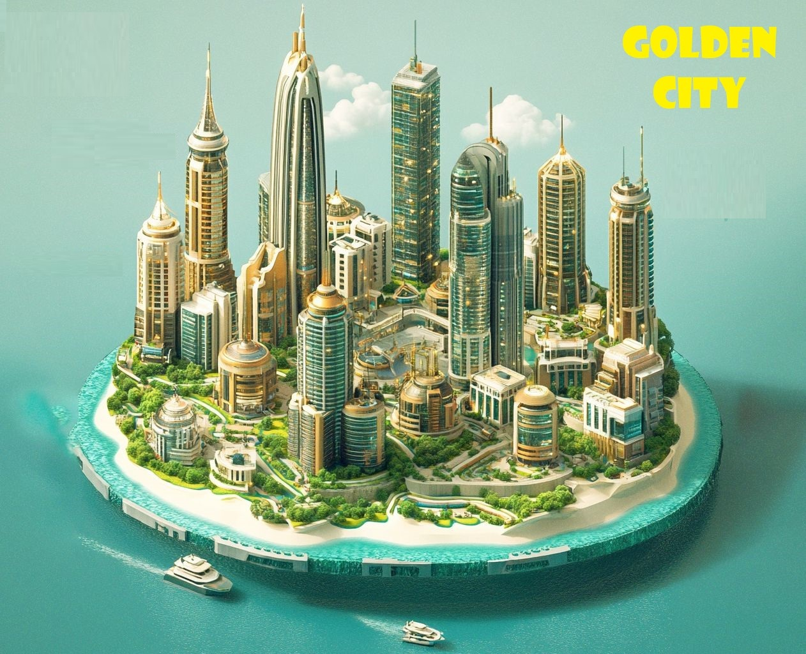

# Golden City

**Developing a responsive real estate platform, a digital housing marketplace, using ReactJS.**

## What is Golden City?

**The proposed real estate platform - Golden City will serve as a digital marketplace where users can seamlessly browse, display, and purchase properties using advanced technologies such as Augmented Reality (AR) and Virtual Reality (VR), alongside Web3 capabilities. By integrating blockchain technology, the platform will ensure secure transactions and ownership verification. This innovative solution aims to revolutionize the real estate experience for buyers, sellers, and agents.**



## Run Locally

Install dependencies

```bash
  npm install
```

Start the server

```bash
  npm start
```